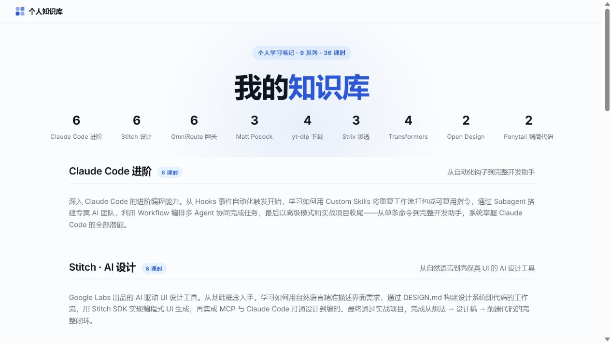
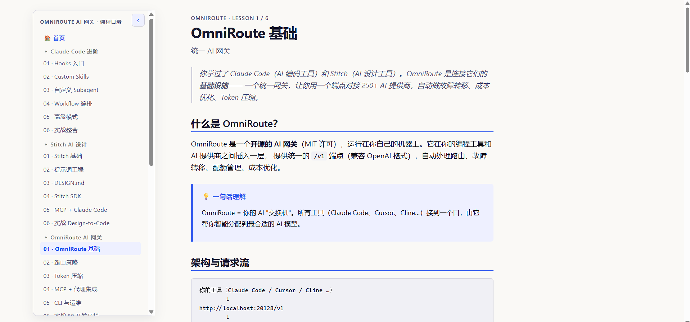

# AI 开发工具链知识库

这是一个基于原生 HTML、CSS 和 JavaScript 构建的静态个人知识库，用课程化页面组织 AI 开发工具、设计工具、音视频工具和模型工具的学习笔记。

在线浏览：[ai-knowledge-base-sooty.vercel.app](https://ai-knowledge-base-sooty.vercel.app)

开发者指南：[index-developer-guide.md](./index-developer-guide.md)

## 页面预览





## 课程

| # | 课程 | 课时 | 简介 |
|---|------|------|------|
| 1 | **Claude Code 进阶** | 6 | Hooks → Skills → Subagents → Workflows → 高级模式 → 实战整合 |
| 2 | **Stitch AI 设计** | 6 | Google Labs AI UI 设计工具，从提示词到 Design-to-Code 流水线 |
| 3 | **OmniRoute AI 网关** | 6 | 开源 AI 网关，250+ 提供商、18 种路由策略、Token 压缩 |
| 4 | **Matt Pocock Skills** | 3 | 工程级 Claude Code 技能包，Grill/TDD/Review/Handoff/Wayfinder |
| 5 | **yt-dlp 音视频下载** | 4 | 全能命令行下载器，从安装到原理到自动化 |
| 6 | **Strix AI 渗透测试** | 3 | 开源 AI 渗透测试工具，多 Agent 漏洞猎人 |
| 7 | **Transformers 模型库** | 4 | Hugging Face 核心 Python 库，Pipeline → 原理 → 指挥模型 |
| 8 | **Open Design 设计工作台** | 2 | 开源 Claude Design 替代，本地优先、Agent 原生 |
| 9 | **Ponytail 精简代码** | 2 | 通过精简代码学习可读性、结构化重构和维护方法 |

共 **9 个系列 · 36 课时**（另有 2 份术语速查表）。

## 课程特点

- **L1 基础操作** — 安装、第一个场景、核心概念
- **L2 常用场景** — 日常 80% 时间在用的功能
- **L3 原理**（部分课程）— 内部机制、关键算法、排查思路
- **L4 集成与自动化**（部分课程）— Skill 封装、API 编程、Agent 编排

## 使用方法

所有课程为 HTML 文件，浏览器打开 `index.html` 即可浏览全部课程目录；也可以使用本地静态服务器验证嵌套课程和相对路径导航。

导航侧边栏由 `assets/nav.js` 自动生成，支持跨课程跳转、当前课时高亮和移动端展开/收起。

## 本地运行

项目不需要构建工具或后端服务，可以直接打开 `index.html`。推荐使用静态服务器：

```powershell
python -m http.server 8000
```

然后访问 `http://127.0.0.1:8000/`。

## 许可

个人学习用途。各课程涉及的第三方工具遵循其自身许可协议（MIT / Apache-2.0 等）。
