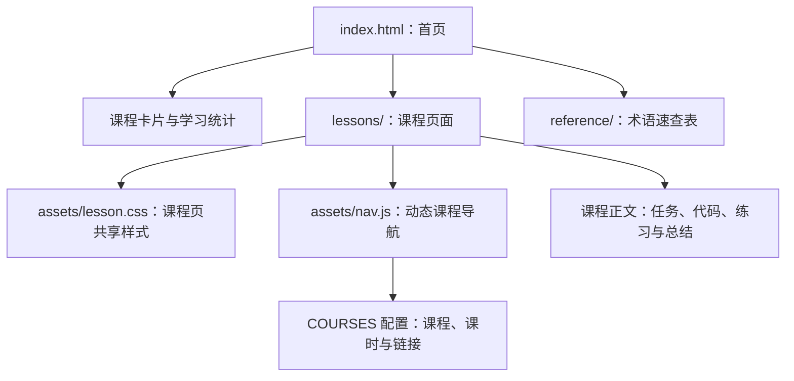

# AI 开发工具链知识库：开发者指南

## 一句话概述

这是一个基于原生 HTML、CSS 和 JavaScript 构建的静态个人知识库，用课程化页面组织 AI 开发工具、设计工具、音视频工具和模型工具的学习笔记。

## 1. 项目背景与解决的问题

当学习内容分散在官方文档、视频、命令行实验和零散笔记中时，后续复习通常会遇到三个问题：

- 内容缺少统一入口，难以按主题和学习顺序浏览。
- 工具的安装、核心概念、实战任务和术语解释彼此分离。
- 新增课程后，首页、课程导航和交叉引用容易出现链接或数量不一致。

本项目通过静态课程目录、独立课时页面、共享侧边栏和术语速查表，将学习资料组织成一个无需后端即可访问的知识库网站。

## 2. 技术栈与运行特征

- HTML5：页面结构、课程内容和语义化区块。
- CSS3：首页视觉样式，以及课程页共享样式。
- 原生 JavaScript：自动生成课程侧边栏、标记当前课时和处理导航展开。
- Google Fonts：使用 Inter 与 JetBrains Mono 字体；网络不可用时会回退到系统字体。
- 无构建工具：不依赖 Node.js、npm、数据库或后端 API。
- 部署形式：可直接部署到任意静态托管平台，例如 Vercel、Netlify 或 GitHub Pages。

## 3. 整体架构



页面之间采用相对路径连接，因此项目目录可以整体复制到静态服务器上运行。首页负责发现和分流，课程页负责承载内容，`nav.js` 负责保持课程页之间的导航一致。

## 4. 目录结构

```text
新建文件夹 (5)/
├── index.html                 # 知识库首页、课程卡片和统计信息
├── assets/
│   ├── lesson.css             # 课程页共享样式
│   └── nav.js                 # 自动生成课程侧边栏
├── lessons/
│   ├── 0001-hooks-basics.html # Claude Code 根目录课程
│   ├── 0002-*.html
│   ├── stitch/                # Stitch AI 设计课程
│   ├── omniroute/             # OmniRoute AI 网关课程
│   ├── mattpocock/            # Matt Pocock Skills 课程
│   ├── yt-dlp/                # yt-dlp 音视频下载课程
│   ├── strix/                 # Strix AI 渗透测试课程
│   ├── transformers/          # Transformers 模型库课程
│   └── open-design/           # Open Design 设计工作台课程
├── reference/
│   ├── glossary.html          # 通用术语表
│   └── stitch-glossary.html   # Stitch 专题术语表
├── README.md                  # 项目说明与课程清单
├── MISSION.md                 # 课程内容和页面规范
├── NOTES.md                   # 维护笔记
└── RESOURCES.md               # 外部学习资源
```

## 5. 核心模块说明

### 5.1 `index.html`

首页是静态内容入口，主要包含：

- 顶部品牌区和项目简介。
- 学习目标与项目统计。
- 按课程分组的课程卡片。
- 每门课程的课时数量、简介和首课链接。
- 通用术语表和 Stitch 专题术语表入口。
- 页脚中的课程数量和项目说明。

首页的课程卡片是手工编写的 HTML，不会从 `nav.js` 自动读取。因此新增或删除课程时，必须同步修改首页卡片、统计数字和页脚信息。

### 5.2 `assets/nav.js`

这是课程页的共享导航模块，使用原生 JavaScript 的 IIFE 封装，避免向全局暴露额外变量。

核心配置是 `COURSES` 数组，每一项描述一门课程：

```js
{
  id: 'stitch',
  name: 'Stitch AI 设计',
  icon: '✦',
  lessons: [
    { file: 'stitch/0001-stitch-basics.html', title: '认识 Stitch' }
  ]
}
```

运行时主要完成以下工作：

1. 根据当前页面路径识别课程和当前课时。
2. 遍历 `COURSES` 生成课程分组和课时链接。
3. 为当前课时添加 `aria-current="page"`，改善可访问性。
4. 根据课程页层级计算首页链接和导航链接的相对路径。
5. 自动滚动侧边栏，使当前课时保持可见。
6. 处理移动端课程导航的展开和收起。

课程页只需要准备导航容器：

```html
<ol class="course-nav__list"></ol>
<script src="../../assets/nav.js"></script>
```

根目录课程位于 `lessons/` 下一级时，脚本路径通常是 `../assets/nav.js`；嵌套课程则需要根据目录深度使用 `../../assets/nav.js`。

### 5.3 `assets/lesson.css`

该文件为课程页提供统一的排版和组件样式，包括：

- 课程页布局和侧边栏。
- `.course-nav` 课程导航。
- `.info-box` 信息提示框。
- `.banner-success` 成功提示。
- `.banner-warning` 警告提示。
- `.exercise` 练习任务区。
- `.steps` 分步骤操作区。
- 代码块、表格、标题和响应式布局。

首页主要样式位于 `index.html` 的内嵌 `<style>` 中，因此首页和课程页的视觉样式来源不同。修改整体品牌色时，需要分别检查这两个位置。

### 5.4 课程 HTML 页面

课程页以单文件 HTML 形式保存，通常包含：

1. 页面标题和课程导航。
2. 课程目标或 Mission 区块。
3. 概念说明与操作步骤。
4. 命令行或配置代码示例。
5. 练习任务与预期结果。
6. 本课总结和延伸阅读。

课程规范、内容结构和 CSS 组件约定记录在 `MISSION.md` 中。新增课程时，应优先复用现有页面结构和 `lesson.css` 的组件，而不是为单个页面重新定义一套样式。

## 6. 当前课程与路由

首页目前提供以下课程入口：

| 课程 | 首页区块 | 首课链接 |
| --- | --- | --- |
| Claude Code 进阶 | `#claude-code` | `lessons/0001-hooks-basics.html` |
| Stitch AI 设计 | `#stitch` | `lessons/stitch/0001-stitch-basics.html` |
| OmniRoute AI 网关 | `#omniroute` | `lessons/omniroute/0001-omniroute-basics.html` |
| Matt Pocock Skills | `#mattpocock` | `lessons/mattpocock/0001-matt-install.html` |
| yt-dlp 音视频下载 | `#yt-dlp` | `lessons/yt-dlp/0001-ytdlp-basics.html` |
| Strix AI 渗透测试 | `#strix` | `lessons/strix/0001-strix-basics.html` |
| Transformers 模型库 | `#transformers` | `lessons/transformers/0001-transformers-basics.html` |
| Open Design 设计工作台 | `#open-design` | `lessons/open-design/0001-opendesign-basics.html` |
| Ponytail 精简代码 | `#ponytail` | `lessons/0007-ponytail-intro.html` |

这里的链接是相对路径，不是服务端路由。部署时必须保留目录结构和文件名大小写。

## 7. 快速开始

### 7.1 直接打开

双击 `index.html` 即可浏览首页和大多数静态课程内容。适合快速查看页面，但不能完全模拟线上服务器的路径行为。

### 7.2 使用本地静态服务器

推荐在项目根目录启动静态服务器：

```powershell
cd "C:\Users\mayikang\Desktop\新建文件夹 (5)"
python -m http.server 8000
```

然后访问：

```text
http://127.0.0.1:8000/
```

这样可以更准确地验证首页、根目录课程、嵌套课程和相对路径导航。

## 8. 新增课程的维护流程

1. 在 `lessons/` 或对应子目录创建课程 HTML 文件。
2. 按 `MISSION.md` 的结构补充目标、正文、示例、练习和总结。
3. 在页面中加入空的 `.course-nav__list` 容器。
4. 按页面目录层级引用 `assets/lesson.css` 和 `assets/nav.js`。
5. 在 `assets/nav.js` 的 `COURSES` 中新增课程和全部课时。
6. 在 `index.html` 中新增课程卡片、首课链接和统计数字。
7. 如有新术语，更新 `reference/` 下的速查表或新增专题术语表。
8. 同步更新 `README.md`、`MISSION.md` 或 `RESOURCES.md` 中的课程数量和清单。
9. 使用本地服务器逐页检查链接、导航高亮和移动端布局。

## 9. 验证清单

发布前建议至少检查：

- 首页所有课程卡片都能打开对应首课。
- 每门课程的上一课、下一课和首页链接路径正确。
- 根目录课程和嵌套课程都能加载 `nav.js`。
- 当前课时有正确的 `aria-current` 标记。
- 课程侧边栏能定位到当前课时。
- 术语速查表链接可访问。
- 窄屏下侧边栏、代码块和表格没有明显溢出。
- 页面在无网络时仍能显示主体内容；Google Fonts 仅作为增强项。
- 新增或删除课程后，首页、`nav.js`、README 和页脚的数量一致。

## 10. 已知问题与维护建议

当前文件之间存在课程数量描述不一致：

- `index.html` 的 `<title>` 仍写着“8 系列 · 34 课时”。
- `README.md` 仍按 8 门课程、34 课时描述。
- 当前首页内容、页脚和 `assets/nav.js` 已包含 Ponytail，实际为 9 个系列、36 个课时。

这不会阻止页面运行，但会造成项目介绍、浏览器标题和实际内容不一致。后续维护时应选择一个真实统计口径，并同步更新 `index.html`、`README.md`、`assets/nav.js` 和相关说明文档。

另外，首页课程信息和 `nav.js` 课程配置目前是两份独立数据。若继续扩展课程数量，建议后续将课程清单抽成 JSON 或 JavaScript 数据模块，由首页和侧边栏共同读取，以减少手工同步错误。

## 11. 版本与维护信息

- 项目类型：静态个人知识库。
- 运行依赖：现代浏览器；本地验证可使用 Python 静态服务器。
- 构建方式：无构建步骤，修改文件后即可预览。
- 外部依赖：Google Fonts；主体内容不依赖外部 API。
- 维护重点：课程文件路径、`assets/nav.js` 的课程配置、首页统计信息和文档中的课程数量必须保持一致。

## 12. 相关文件

- 首页：[index.html](./index.html)
- 课程导航：[assets/nav.js](./assets/nav.js)
- 课程样式：[assets/lesson.css](./assets/lesson.css)
- 课程规范：[MISSION.md](./MISSION.md)
- 项目说明：[README.md](./README.md)
- 通用术语表：[reference/glossary.html](./reference/glossary.html)

